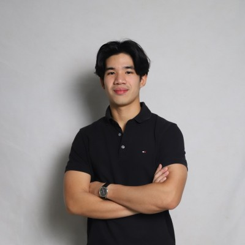
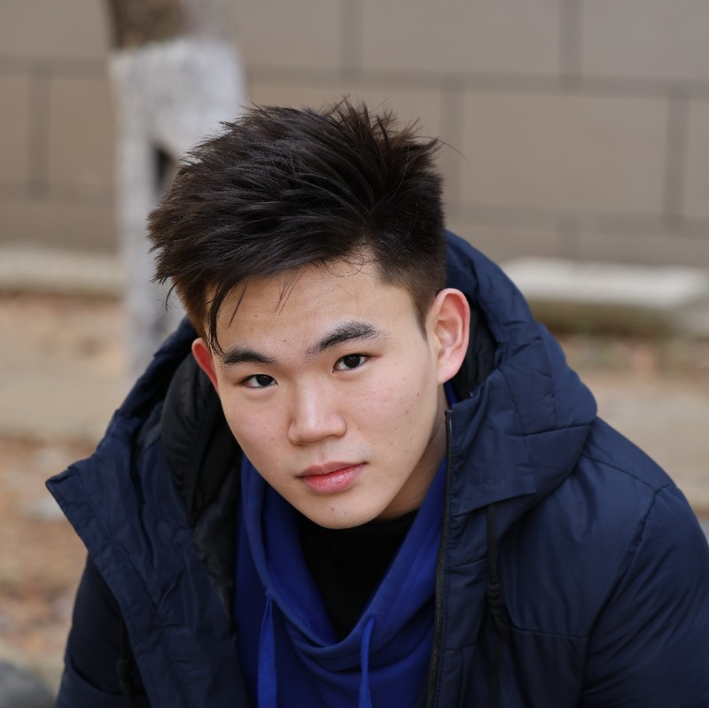
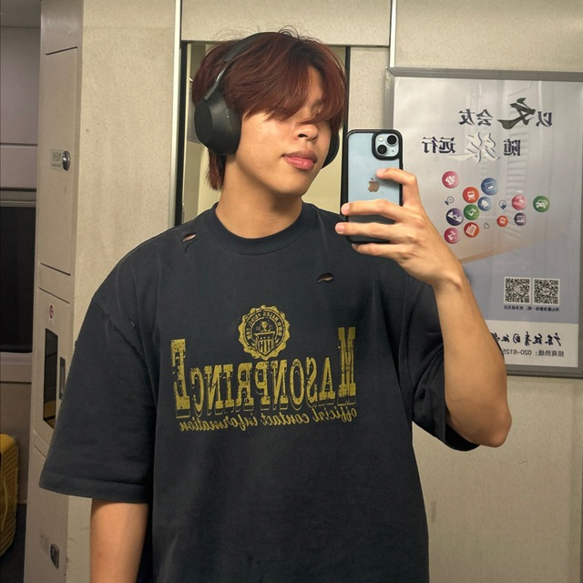
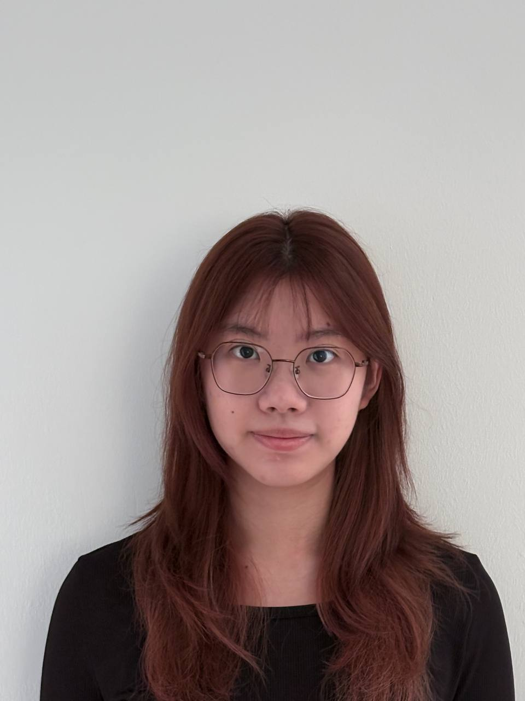
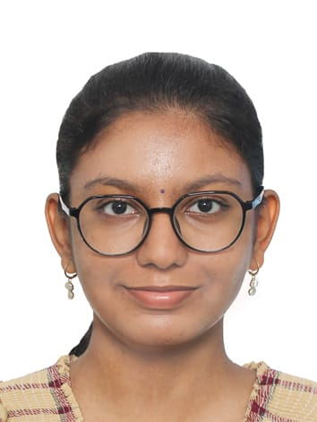

We are a team based in the [School of Computing, National University of Singapore](https://www.comp.nus.edu.sg).

## Project team

### Jared Ee

[[github](https://github.com/jaredee123)]

* Role: Developer
* Responsibilities: Created detailed contact view, favourite contacts, and enhanced delete command.

### Zhao Zhe Kai, Winston

[[github](https://github.com/winstonzhaozhekai)]

* Role: Developer
* Responsibilities: Designed course-grouped UI, revamped help command, and added summary command.

### Liang Ka Hei

[[github](https://github.com/kahei9299)]

* Role: Developer
* Responsibilities: Developed colour-coded tags, tag-based search, partial name match, and bulk deletion features.

### Lee Yi Xuan

[[github](http://github.com/bobbodi)]

* Role: Developer
* Responsibilities: Implemented undo/redo, command history, themes, and contact copying.

### Subhitsha Prabakaran

[[github](https://github.com/subhitsha-sp)]

* Role: Developer
* Responsibilities: Built contact listing by courses, sorting, birthday command, and command aliases.
